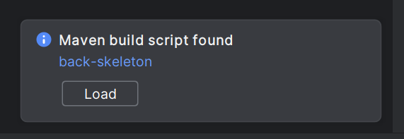
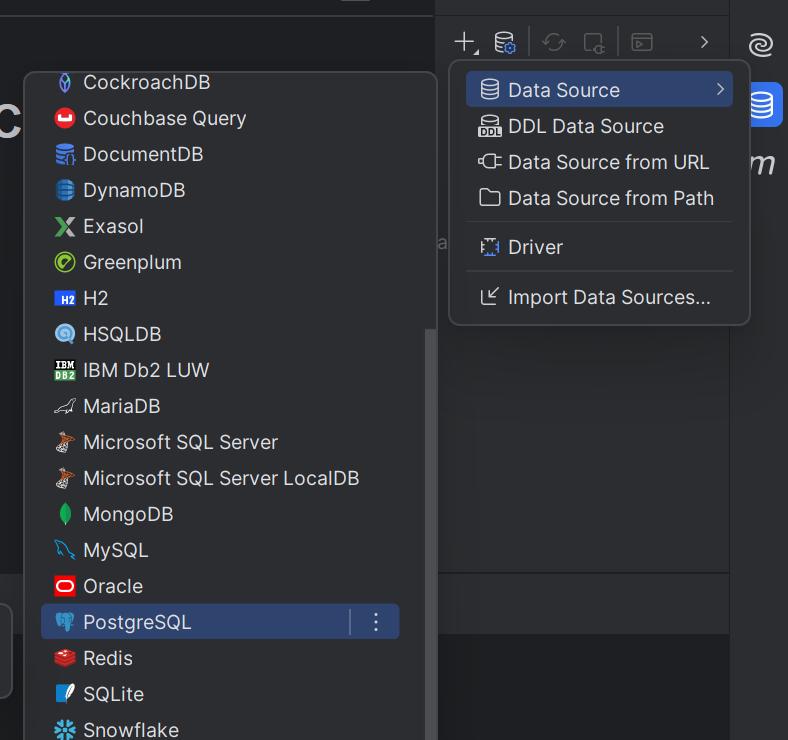
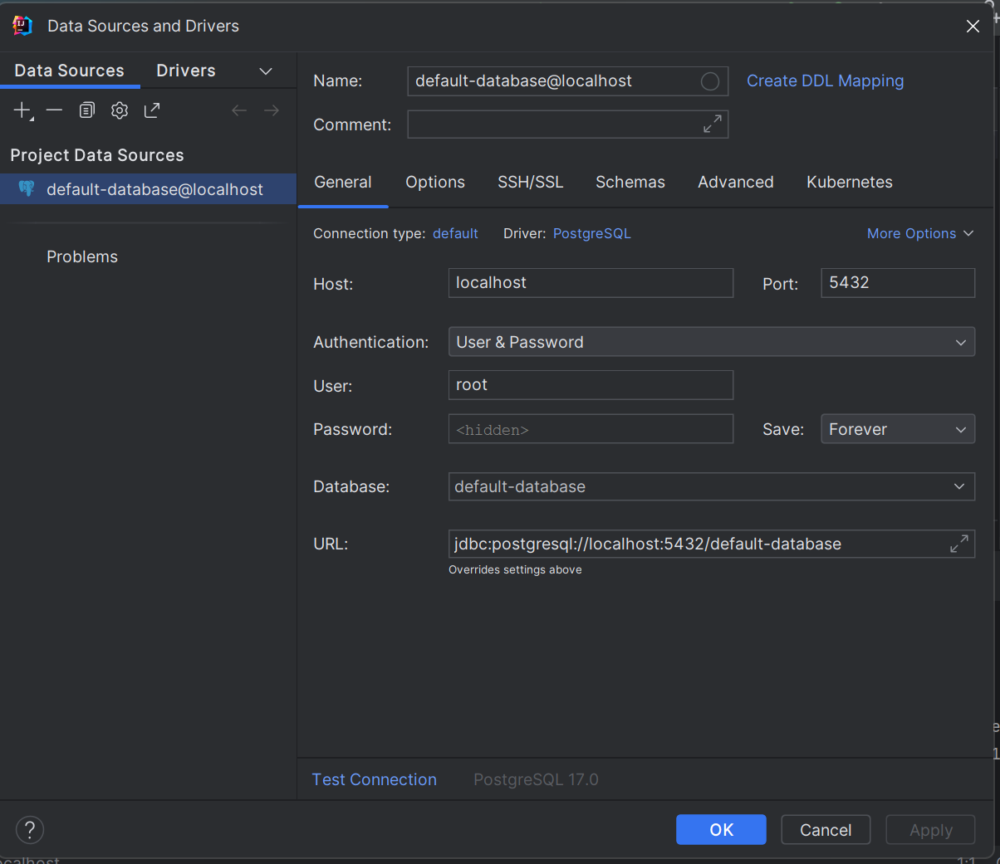
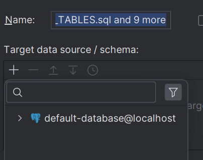
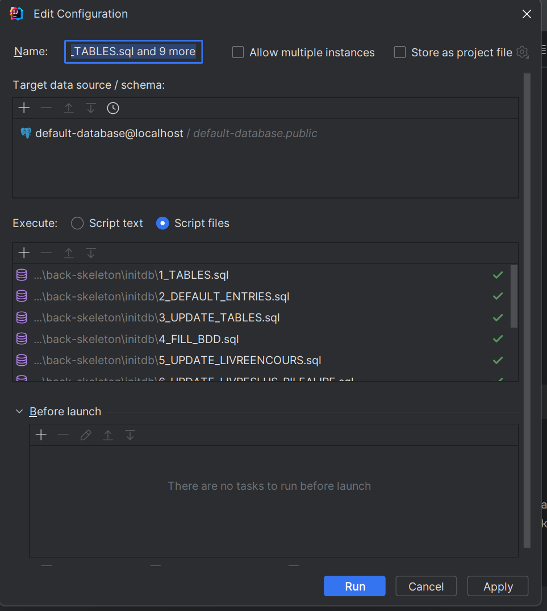
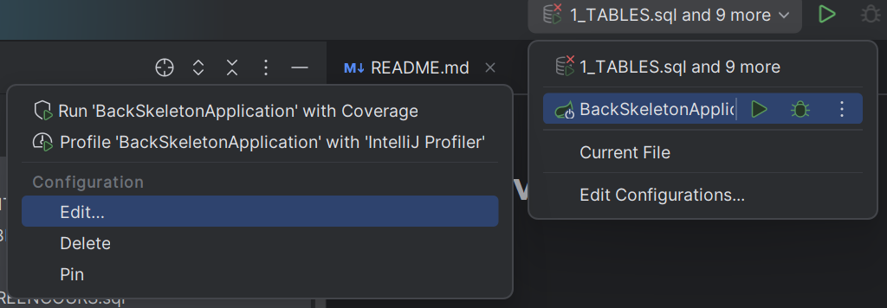
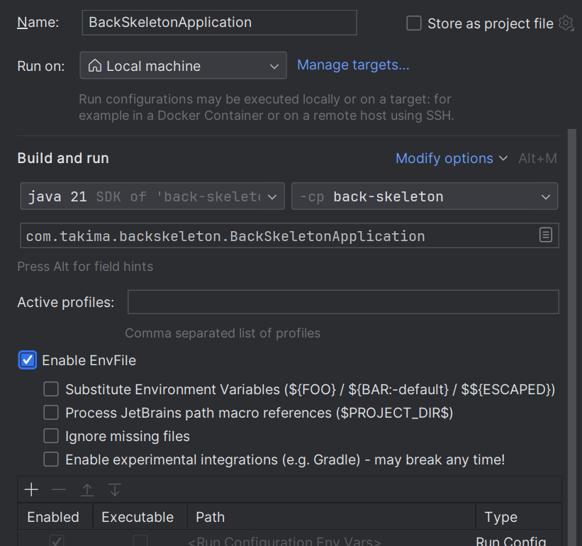
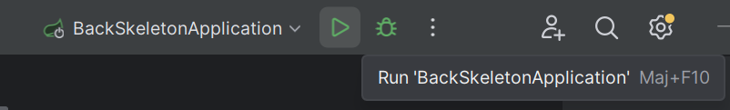

# ProjetLivresBACK

## Pour lancer le back : 

UTILISATION DE INTELLIJ

1. Load le build du projet maven de 'back-skeleton'

   

2. Lancer docker, et dans le terminal du projet, écrire :
   1. cd back-skeleton
   2. docker compose up 

3. Dans l'onglet database, appuyer sur 'new' --> 'Data Source' --> 'PostgreeSQL'

   

4. Ensuite, dans la fenêtre qui s'affiche, entrer :
   1. User : root
   2. Password : toor
   3. Database : default-database

   

5. Dans l'arborescence 'back-skeleton' --> 'initdb', sélectionner les 10 scripts, faire un clic droit et appuyer sur 'Run ...'

   

6. Une fenêtre s'ouvre, appuyer sur + et sélectionner la database, puis ensuite appuyer sur 'run'

   
   

7. Après cette manipulation, la database est composée de 6 tables remplies.

8. Pour finir, ajoutons nos variables d'environnement au projet :
   1. Cliquer sur '...' de 'BackSkeletonApplication', puis sur 'edit'
      
      
      
   2. Télécharger et ajouter le pluggin : https://plugins.jetbrains.com/plugin/7861-envfile
   3. L'option 'Enable EnvFile' s'affichera alors. La cocher.

   

   4. Cliquer sur le '+' et s'électionner .env file

   

   5. Puis sélectionner le chemin jusqu'au fichier .env puis appuyer sur ok:

      chemin-jusqu-au-projet\fichier-projet\back-skeleton\.env
   

9. On peut maintenant lancer l'application
   